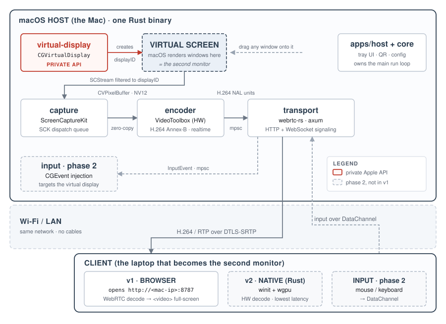

# Annex

> **Extra desktop, no extra hardware.**

Annex turns any laptop on your local network into a real, **extended** second monitor for a
Mac. Not a mirror of your main screen: a genuine new desktop area you can drag windows onto,
exactly as if you had plugged in a physical monitor.

No HDMI. No capture card. No cloud. Both machines just need to be on the same Wi-Fi.

The Mac runs a single Rust binary. The second machine opens a URL in its browser.

> [!NOTE]
> **Status: M0 and M1 done.** The virtual display works and ScreenCaptureKit captures it.
> Verified 27 July 2026 on macOS 26.5. Encode and transport are still `todo!()`.
> See [Roadmap](#roadmap).
>
> ```
> $ cargo run -p annex-host -- m1 6
>   displayID = 13
>   current mode: 1920x1080 points, 1920x1080 backing pixels  (1x, capture at scale 1)
>   frame  0   1920 x 1080  stride 7680   BGRA  pts 1252500503785us  luma 0.098
>   captured 6 frames, wrote 6 PNGs to captures
> ```

## How it works



A virtual display is created on the Mac, macOS renders windows onto it as if it were real
hardware, and those pixels are captured, hardware-encoded, and streamed over the LAN to a
client that paints them full-screen.

## The core insight: this is two separate problems

They share almost no techniques and differ enormously in difficulty.

| Half | Job | Mechanism | Difficulty |
|---|---|---|---|
| **1. Virtual display** | Make macOS believe a monitor is attached, so windows can live there | Private, undocumented `CGVirtualDisplay` APIs in CoreGraphics | **Hard** |
| **2. Capture and stream** | Grab that display's pixels, encode, send, render | ScreenCaptureKit, VideoToolbox, WebRTC | **Well-trodden** |

Half 1 is what makes this an *extend* rather than a *mirror*. You cannot capture a desktop
area that macOS is not already rendering somewhere, so a display has to exist for the windows
to occupy. A physical monitor does that over HDMI, a dummy plug fakes it in hardware, and
`CGVirtualDisplay` fakes it in software.

Half 2 alone would just be another screen-mirroring tool. Building both is what makes Annex
self-contained.

## Pipeline

```
CGVirtualDisplay  ->  displayID  ->  SCStream (CVPixelBuffer, NV12)
                  ->  VTCompressionSession (H.264 Annex-B, realtime, no B-frames)
                  ->  mpsc channel  ->  webrtc-rs track  ->  DTLS/SRTP over the LAN
                  ->  browser <video>, full-screen
```

Frames stay on the GPU from capture through encode. Encoded samples cross a bounded channel
into the tokio world, where a WebRTC peer connection packetizes and sends them. Phase 2
reverses a second channel: input events travel back over a DataChannel and are injected with
`CGEvent`.

Target glass-to-glass latency is 30 to 60 ms on decent 5 GHz Wi-Fi.

## Layout

```
annex/
├─ crates/
│  ├─ core/              shared types, config, errors, pipeline glue
│  ├─ virtual-display/   PRIVATE API lives here and nowhere else
│  ├─ capture/           ScreenCaptureKit  ->  CVPixelBuffer
│  ├─ encoder/           VideoToolbox      ->  H.264 / HEVC NAL units
│  ├─ transport/         webrtc-rs peer + axum HTTP/WebSocket signaling
│  └─ input/             phase 2: CGEvent injection
├─ apps/
│  ├─ host/              macOS binary: tray UI, run loop, wiring
│  └─ client-native/     phase 2: winit + wgpu client
└─ web/client/           v1 browser client, served by the host
```

All contact with private Apple APIs is confined to `crates/virtual-display`, so a macOS
update that changes those APIs breaks exactly one file.

Crate packages carry an `annex-` prefix (`annex-core`, `annex-capture`, and so on). A package
named plainly `core` would shadow the built-in `core` crate at every `use core::` site.

## Building

```bash
rustup toolchain install stable   # rust-toolchain.toml pins the rest
cargo check --workspace
cargo run -p annex-host -- 20     # M0: create a display, hold 20s, remove it
cargo run -p annex-host -- m1 10  # M1: capture 10 frames to ./captures
```

M1 needs the **Screen Recording** permission. Running under `cargo` means macOS attaches the
grant to your terminal rather than to Annex, and TCC decisions are read at process start, so
you have to restart the terminal after granting it. A signed `.app` bundle fixes this properly
at M6.

`annex-virtual-display` and `annex-capture` have real dependencies (the `objc2` family). The
remaining crates are std-only stubs; their dependency versions are declared in the root
`[workspace.dependencies]` but not wired in yet, and each crate's `Cargo.toml` lists which
ones to enable at which milestone.

No special linker flags are needed for the private API. The classes are resolved by name at
runtime with `AnyClass::get`, so there is no link-time symbol to satisfy: CoreGraphics is
already loaded into the process.

## Roadmap

| | Milestone | Deliverable |
|---|---|---|
| **M0** | Virtual-display spike | **Done.** A fake monitor appears in System Settings and drops cleanly on exit |
| **M1** | Capture to disk | **Done.** ScreenCaptureKit delivers BGRA frames from the virtual display, written to PNG |
| **M2** | Encode and verify | VideoToolbox to H.264, decode locally to confirm a valid low-latency stream |
| **M3** | WebRTC to browser | Stream the *main* display full-screen, proving the whole network path |
| **M4** | Extended display E2E | Point capture at the virtual display. **v1 done.** |
| **M5** | Interactive input | DataChannel input, `CGEvent` injection |
| **M6** | Polish | Tray UI, QR code, auth token, resolution picker, multi-client, HEVC |
| **M7** | Native client | winit and wgpu app with hardware decode for lowest latency |

M3 deliberately uses the real main display, so the streaming half is proven before anything
depends on the private virtual-display API. The two halves are validated independently and
joined at M4.

## Requirements

- **Host:** macOS 12.3 or later (ScreenCaptureKit), Apple Silicon or Intel
- **Client:** any device on the same network with a modern browser
- **Permissions:** Screen Recording, plus Accessibility for phase-2 input

Annex is not distributed on the Mac App Store, because App Review rejects private APIs and
the virtual display is worth more than the storefront. It ships signed and **notarized** under
a Developer ID instead, so Gatekeeper launches it without warnings. Notarization is an
automated malware scan and does not inspect for private-API use, which is how DeskPad,
BetterDummy, BetterDisplay and SimpleDisplay all ship.

## Scope

LAN only, by design. No STUN, no TURN, no relay servers, no account, and no data leaving
your network. WebRTC media is always encrypted with DTLS-SRTP.

Not in v1: audio forwarding, internet or NAT traversal, the reverse direction (Windows host
to Mac client), and multi-client fan-out.

## Documentation

The full architecture and design document is [docs/architecture.html](docs/architecture.html),
with a print-ready copy at [docs/Annex-Architecture.pdf](docs/Annex-Architecture.pdf). It
covers component design, the threading model, sequence diagrams, the latency budget, risks,
testing strategy, and a reverse-engineered `CGVirtualDisplay` header.

## Prior art

Every piece of this already exists in shipping software. Annex combines them in one Rust
codebase.

| Project | What it proves | Licence |
|---|---|---|
| [DeskPad](https://github.com/Stengo/DeskPad) | The `CGVirtualDisplay` trick | MIT |
| [BetterDummy](https://github.com/waydabber/BetterDummy) | Same, independently | MIT |
| [SimpleDisplay](https://simpledisplay.app) | Same, on current macOS | GPL-3.0 |
| [Deskreen](https://github.com/pavlobu/deskreen) | Browser-as-second-screen streaming | AGPL-3.0 |

The virtual-display projects stop at creating the display and tell you to reach it over VNC
or Parsec. Deskreen streams, but mirrors an existing screen. Annex does both halves.
